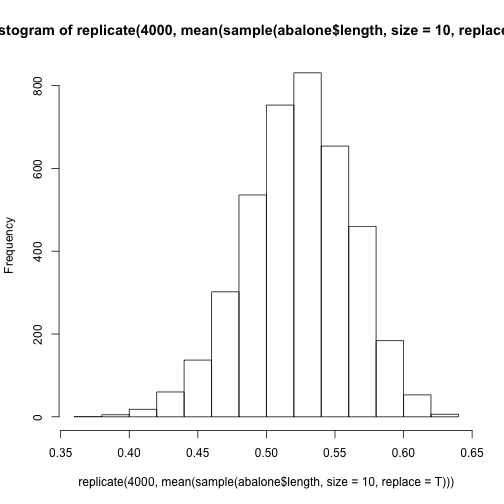

데이터분석 기본과정 (2주차)
========================================================
author: Sang Yeol Lee
date: May 29 2017
width: 1200 
height: 1700
transition: linear
transition-speed: slow
autosize: true

<small> 
- 대상자 : 데이터 분석 기본과정
- R 기초
- Python 기초
- 데이터 분석 기초
</small>


========================================================
id: slide1
type: prompt
## 2주차 프로그래밍 언어학습

### * 소개 및 프로그램 설치 (5/6h)
### * MIT 스크래치 (1/6h)
### * Python (1h)
### * R (2h)

<br>

## 레퍼런스
MIT 스크래치 : <https://opentutorials.org/module/964/6951>

Python : <http://byteofpython-korean.sourceforge.net/byte_of_python.html>

R : 
  - 1) R(기초) 39차 공개과정 통계자료분석과정 - 서울대학교 통계연구소
  - 2) 노만 매트로프 - 빅데이터 분석 도구 R 프로그래밍
  - 3) 타이타닉 캐글 튜토리얼

SQL : 뇌를 자극하는 SQL server 2012 기본편

<br>

## 온오프믹스 링크
<http://onoffmix.com/event/99641>

========================================================
## 이상열


***

<br>

### 학력 : 고려대학교 산업경영공학 
  * 응용통계 연구실 (석사 졸업)
  * 논문: 빅데이터 분석을 위한 슈퍼컴퓨터 환경에서 R의 병렬처리

### 경력 : 넷마블게임즈 근무 
  * 인사이트팀
  * AI Lab 

### 취미 : 커뮤니티 운영
  - R 커뮤니티 운영진 (현재, <http://r-kor.org>)
  - 데이터 분석 활용 운영진 (현재, <http://cafe.naver.com/datageeks>) 
  - 캐글뽀개기 운영진 (현재, <https://www.facebook.com/groups/kagglebreak>) 
  
### Email : syleeie@gmail.com
### github : https://github.com/kagglebreak


Show Time (R)
========================================================


```r
summary(cars)
```

```
     speed           dist       
 Min.   : 4.0   Min.   :  2.00  
 1st Qu.:12.0   1st Qu.: 26.00  
 Median :15.0   Median : 36.00  
 Mean   :15.4   Mean   : 42.98  
 3rd Qu.:19.0   3rd Qu.: 56.00  
 Max.   :25.0   Max.   :120.00  
```


Show Time (Python)
========================================================

```python
age = 20
name = 'Swaroop'

print ('{0} was {1} years old when he wrote this book').format(name, age)
print ('Why is {0} playing with that python?').format(name)
```

```
Swaroop was 20 years old when he wrote this book
Why is Swaroop playing with that python?
```


```python
for i in range(1, 5):
    print (i)
else:
    print ('The for loop is over')
```

```
1
2
3
4
The for loop is over
```


========================================================
## 첫시간 : 설치 (Install)
[Go to slide 1](#/slide1)

- 먼저 컴퓨터 운영체제 확인

<br>

- R, RStudio,Anaconda, Pycharm 설치 진행 예정

<br>

- 설치 문제 발생 시 손들고 질문해주세요

========================================================

## 설치 (Install)

### R install
(https://cran.rstudio.com/bin/windows/base/)
* 3.4.0 최신 버전, 32/64비트

> R 프로그래밍 언어(줄여서 R)는 통계 계산과 그래픽을 위한 프로그래밍 언어이자 소프트웨어 환경이다. 뉴질랜드 오클랜드 대학의 로버트 젠틀맨(Robert Gentleman)과 로스 이하카(Ross Ihaka)에 의해 시작되어 현재는 R 코어 팀이 개발하고 있다. R은 GPL 하에 배포되는 S 프로그래밍 언어의 구현으로 GNU S라고도 한다. R은 통계 소프트웨어 개발과 자료 분석에 널리 사용되고 있으며, 패키지 개발이 용이하여 통계학자들 사이에서 통계 소프트웨어 개발에 많이 쓰이고 있다.

- R 프로젝트 : <https://www.r-project.org/>

- CRAN 서버 : <https://cran.r-project.org/mirrors.html>

- R 블로거 : <https://www.r-bloggers.com/>

- CRAN Task View
<https://cran.r-project.org/web/views/>

- MRAN (Microsoft R Application Network)
<https://mran.microsoft.com/>

========================================================

### 왜 분석도구로 R인가?

- 기존의 통계툴인 SAS, SPSS에 비해서 자유롭게 변형 가능

- R은 데이터 분석에 특화된 프로그래밍 언어이자 오픈소스 패키지의 집합이다.
- 프로그래밍 언어 - 자유로운 데이터 분석이 가능
  * Graphical User Interface (GUI) 를 이용한 분석 환경은 처음에는 접근이 쉬우나 확장성에 한계가 있음
  * 스스로 새로운 기능을 추가하는 것도 자유로움

- 오픈소스 패키지의 집합 (통계, 기계학습, 금융, 생물정보학, 그래픽스)에 이르는 다양한 패키지가 무료로 제공됨.

* 최신 통계 분석 알고리즘의 우선 구현 : LARS, twitter 데이터 처리 등
* 빅데이터 처리 : SparkR, Rhive, RHadoop 등
* 방대한 온라인 자료 : Stack Overflow [link](https://stackoverflow.com/questions/tagged/r)


========================================================

### O'Reilly 2016 Data Scientit Salary Survey

<br>

- [link](https://www.datanami.com/2016/10/10/whats-driving-data-science-salaries-now/)

- 미국의 데이터 과학자들의 평균 급여

- 오라일리 (O'Reilly)의 최근 2016 년 데이터 과학 연봉 조사 (Data Science Salary Survey )에 따르면 엑셀을 사용하는 회사를 위해 일하고 여성은 연봉이 낮은 것과 밀접한 상관 관계가 있다.

- 데이터 과학자 평균 급여 약 75,000 달러.
- IOR 범위 (55,000 ~ 110,000 달러)

***
<br>


========================================================

### R Example Project (Fun)
- Leaflet is one of the most popular open-source JavaScript libraries for interactive maps.

<https://rstudio.github.io/leaflet/>

- This is an introduction to wordcloud2 package. This package provides an HTML5 interface to wordcloud for data visualization. Timdream’s wordcloud2.js is used in this package.

<https://cran.r-project.org/web/packages/wordcloud2/vignettes/wordcloud.html>


- ggplot2 is a plotting system for R, based on the grammar of graphics, which tries to take the good parts of base and lattice graphics and none of the bad parts. It takes care of many of the fiddly details that make plotting a hassle (like drawing legends) as well as providing a powerful model of graphics that makes it easy to produce complex multi-layered graphics.

<http://www.r-graph-gallery.com/portfolio/ggplot2-package/>

- Network Analysis and Visualization with R and igraph

<http://kateto.net/networks-r-igraph>

========================================================
## 설치 (Install)
### RStudio install
Desktop
Open Source License
: <https://www.rstudio.com/products/rstudio/download/>

> RStudio is a free and open-source integrated development environment (IDE) for R, a programming language for statistical computing and graphics. RStudio was founded by JJ Allaire,[5] creator of the programming language ColdFusion. Hadley Wickham is the Chief Scientist at RStudio

- 다른 IDE Tools sublime <https://www.sublimetext.com/>


========================================================
## 설치 (Install)
### Anaconda install
Anaconda Download
: <https://www.continuum.io/downloads>

- Python 2.7 vs Python 3.6
  * [link](https://zetawiki.com/wiki/Python_%EB%B2%84%EC%A0%84_2%EC%99%80_3_%EC%B0%A8%EC%9D%B4)

- Python 3을 설치하는 것을 추천합니다.
- Anaconda?
  *  아나콘다는 레드햇에서 만든 설치 소프트웨어 중 하나
  * 파이썬 기반의 데이터 분석에 특화된 각종 OpenSource 패키지들을 모아놓은 개발 플랫폼
  * 편리함. 기본 Python 버전으로 설치 시에 패키지 관리를 pip 시스템 이용 
  * 물론 아나콘다로 익숙해지다가 pip로 넘어가는 것이 유리
  * 윈도우 환경에서는 설정 관리하기 불편하니 아나콘다가 편리할 수도 있

- 윈도우 환경에서 파이썬의 pip 설치 방법 : [link](http://be4rpooh02.tistory.com/8)

========================================================
## 설치 (Install)
### Pycharm 설치
Pycharm Community download :
<https://www.jetbrains.com/pycharm/download/>

> PyCharm is an Integrated Development Environment (IDE) used in computer programming, specifically for the Python language. It is developed by the Czech company JetBrains.[2] It provides code analysis, a graphical debugger, an integrated unit tester, integration with version control systems (VCSes), and supports web development with Django.


- Pycharm도 Sublime, RStudio와 같은 IDE. 무료/유료 버전이 있음
- 무료 버전인 Community Edition으로 충분히 개발 가능
- [Python] 윈도우 개발환경 구축 - PyCharm 설치, 설정, 프로젝트 만들기 : [link](http://nexablue.tistory.com/entry/Python-%EC%9C%88%EB%8F%84%EC%9A%B0-%EA%B0%9C%EB%B0%9C%ED%99%98%EA%B2%BD-%EA%B5%AC%EC%B6%95-PyCharm-%EC%84%A4%EC%B9%98-%EC%84%A4%EC%A0%95-%ED%94%84%EB%A1%9C%EC%A0%9D%ED%8A%B8-%EB%A7%8C%EB%93%A4%EA%B8%B0)


========================================================

### Python Example Project (Fun)
- Django is a high-level Python Web framework that encourages rapid development and clean, pragmatic design. 

<https://www.djangoproject.com/>

- 텐서플로우(TensorFlow™)는 데이터 플로우 그래프(Data flow graph)를 사용하여 수치 연산을 하는 오픈소스 소프트웨어 라이브러리입니다.  텐서플로우는 원래 머신러닝과 딥 뉴럴 네트워크 연구를 목적으로 구글의 인공지능 연구 조직인 구글 브레인 팀의 연구자와 엔지니어들에 의해 개발되었습니다. 

<https://tensorflowkorea.gitbooks.io/tensorflow-kr/content/g3doc/get_started/os_setup.html>

- Gensim Project, Topic modeling for Humans

<https://www.lucypark.kr/slides/2015-pyconkr/#1>

- Plotly (Plotly's Python graphing library makes interactive, publication-quality graphs online. Examples of how to make line plots, scatter plots, area charts, bar charts, error bars, box plots, histograms, heatmaps, subplots, multiple-axes, polar charts, and bubble charts)

<https://plot.ly/python/>

========================================================

## 첫시간(2) : MIT 스크래치
[Go to slide 1](#/slide1)

> 스크래치(Scratch)는 아이들에게 그래픽 환경을 통해 컴퓨터 프로그래밍에 관한 경험을 쌓게 하기 위한 목적으로 설계된 교육용 프로그래밍 언어 및 환경이다.[1]

> 스퀵을 기반으로 스몰토크라는 언어로 작성되었다. 코딩을 주로하는 C++,C#, 비주얼 베이직 등과 달리 블록을 끌어당겨 탑을 쌓는 것처럼 프로그래밍을 하기 때문에 프로그래밍을 처음 해보는 입문자들에게 권하는 프로그래밍 언어다. 

> 스크래치 2.0의 하위 버전인 1.4 버전은 오픈 소스라서 누구든지 스크래치 모딩(스크래치 모드를 만드는 행위)을 할 수 있다.

- 강의링크 : [link](https://opentutorials.org/module/964/6951)


- 시작 페이지 [link](scratch.mit.edu)

스크래치로 만든 게임입니다. 스크래치를 이용하면 이렇게 복잡한 게임도 만들 수 있습니다. 수업 시작하기 전에 게임 한판하고 시작하시죠!

- http://scratch.mit.edu/projects/21105296/
- http://scratch.mit.edu/projects/2792282/ 
- http://scratch.mit.edu/projects/20304075/
- http://scratch.mit.edu/projects/21554369/
- http://scratch.mit.edu/projects/22314097/
- https://scratch.mit.edu/projects/11882821

========================================================

## MIT 스크래치 튜토리얼

1. 회원가입하고 로그인하기

2. 기본수업 
  - 작업한 것을 저장하기
  - 그림을 위치시켜 봅시다
  - 그림을 변경하기
  - 그림을 그려봅시다
  - 사진을 올려봅시다
  - 애니메이션을 만들어봅시다.
  - 자동 재생되는 애니메이션을 만들어 봅시다.
  - 좌표를 알아봅시다
  - 고양이를 움직여봅시다
  - 고양이에게 먹이를 줍시다
  - 고양이가 먹은 음식의 숫자 세기
  
========================================================

# Break

<br>

# 쉬는 시간 10min

<br>

# 질문은 메세지로 받겠습니다.

# 이상열, 010-3414-2310


========================================================
 
## 두 번째 시간 : Python 기초 
[Go to slide 1](#/slide1)

### - 1) 기초문법 학습 (Byte of Python)

<br>

### - 2) Numpy, Pandas 학습

<br>

### - 3) 그 외 유용한 라이브러리 소개

<br>

### - 4) IDE
### - Jupyter notebook
### - Pycharm 

1) 기초문법 학습 (1)
========================================================

```python
print("Hello World")
```

```
Hello World
```

1) 프로그램(hello.py)을 작성해보자!

```
python hello.py
```


2) help('len')

```python
help('len')
```

```
Help on built-in function len in module __builtin__:

len(...)
    len(object) -> integer
    
    Return the number of items of a sequence or collection.
```


1) 기초문법 학습 (2)
========================================================

3) 주석 (# 문자 뒤에 따라오는 짧은 문장. 주로 소스 코드를 읽을 때)

```python
print('hello world') # Note that print is a statement
```

```
hello world
```

<br>

4) 숫자형
- 정수형(Integer)과 부동 소수점 숫자형(Float)의 두 가지 종류

- 정수형 숫자의 예는 2
- 부동 소수점 숫자의 예는 3.23, 52.3E-4

<br>

5) 문자열
- 문자열이란 _문자_의 _나열_을 뜻합니다. 문자열은 간단하게 말하자면 문자들의 집합입니다. 

- 작은 따옴표 '' 
- 큰 따옴표 "" :큰 따옴표로 둘러싸인 문자열은 작은 따옴표로 둘러싸인 문자열과 완전히 동일하게 취급됩니다.

- 따옴표 세 개 """ """
- '''This is a multi-line string. This is the first line.
This is the second line.
"What's your name?," I asked.
He said "Bond, James Bond."
'''

1) 기초문법 학습 (3)
========================================================

6) 문자열 포맷팅

```python

# 사용자 지정 키워드를 이용해 (Swaroop wrote A Byte of Python) 표기
print('{name} wrote {book}').format(name='Swaroop', book='A Byte of Python')

```

```
Swaroop wrote A Byte of Python
```

<br>

7) 이스케이프(Escape) 문자

```python
'This is the first line\nThis is the second line'
```

<br>

8) 변수(variables)

**식별자 이름 짓기**

- 식별자의 첫 문자는 알파벳 문자 (ASCII 대/소문자 혹은 유니코드 문자)이거나 밑줄 (_) 이어야 합니다.

- 나머지는 문자 (ASCII 대/소문자 혹은 유니코드 문자), 밑줄 (_), 또는 숫자 (0-9)가 될 수 있습니다.

- 식별자는 대/소문자를 구분합니다. 예를 들어, myname 과 myName 은 다릅니다. 전자의 `n`은 소문자이고, 후자의 `N`은 대문자입니다.

- 올바른 식별자 이름은 i, name_2_3 등과 같습니다. 올바르지 않은 식별자 이름은 2things, this is spaced out, my-name, >a1b2_c3 등입니다.


1) 기초문법 학습 (4)
========================================================

9) 들여쓰기

- 한 논리적 명령행의 앞에 붙어있는 공백 (빈 칸 혹은 탭)은 논리적 명령행의 들여쓰기 단계를 의미

- 새 블록을 시작할 수 있는 경우에 대해 흐름 제어 챕터에서 다루게 될 것입니다.


```python
i = 5
# 다음 행에서 오류가 발생합니다! 행 앞에 잘못된 공백이 한 칸 있습니다.
 print 'Value is ', i
print 'I repeat, the value is ', i
```

```
  File "<string>", line 3
    print 'Value is ', i
    ^
IndentationError: unexpected indent
```

<br>

들여쓰기 하는 법
- 들여쓰기를 할 때에는 공백 4개를 이용하세요

10) 연산자와 수식
- _연산자_란 무언가를 계산할 때 쓰이는 한 기능을 뜻하며, +`와 같이 기호로 나타내어지거나 또는 특별한 키워드로 나타내어집니다. 

- 연산자는 계산에 사용될 데이터를 필요로 하는데, 이들을 _피연산자_라고 부릅니다. 이 경우, 피연산자는 `2 와 3 이 됩니다.


```python
print(2 + 3)
```

```
5
```


```python
a = 2
a = a * 3
print(a)
```

```
6
```

1) 기초문법 학습 (5)
========================================================

11) 연산 순서

- [link](https://docs.python.org/3/reference/expressions.html#operator-precedence)

<br>

- expression.py를 작성해보시오.

```
length = 5
breadth = 2

area = length * breadth
print ('Area is', area)
print ('Perimeter is', 2 * (length + breadth))
```

- python expression.py

<br>

12) 흐름 제어

- 지금까지 우리가 본 파이썬 프로그램들은 전부 맨 윗줄부터 차례대로 실행되기만 하는 것들 뿐이었습니다. 이러한 실행 흐름을 바꿀 수 있다면 어떨까요? 

1) if 문

```
number = 23
guess = int(input('Enter an integer : '))

if guess == number:
    # New block starts here
    print ('Congratulations, you guessed it.')
    print ('but you do not win any prizes!')
    # New block ends here
elif guess < number:
    # Another block
    print ('No, it is a little higher than that')
    # You can do whatever you want in a block ...
else:
    print ('No, it is a little lower than that'
    # you must have guessed > number to reach here)

print ('Done')
# This last statement is always executed,
# after the if statement is executed.
```

- python if_example.py


1) 기초문법 학습 (6)
========================================================

12) 흐름 제어

2) while 문

```
number = 23
running = True

while running:
    guess = int(input('Enter an integer : '))

    if guess == number:
        print ('Congratulations, you guessed it.')
        # this causes the while loop to stop
        running = False
    elif guess < number:
        print ('No, it is a little higher than that.')
    else:
        print ('No, it is a little lower than that.')
else:
    print ('The while loop is over.')
    # Do anything else you want to do here

print ('Done')
```

- python while_example.py


1) 기초문법 학습 (7)
========================================================

12) 흐름 제어

3) for 루프

- for..in 문은 객체의 열거형(Sequence)을 따라서 반복하여 실행할 때 사용되는 파이썬에 내장된 또 하나의 반복문으로, 열거형에 포함된 각 항목을 하나씩 거쳐가며 실행합니다. 


```python
for i in range(1, 5):
    print (i)
else:
    print ('The for loop is over')
```

```
1
2
3
4
The for loop is over
```


1) 기초문법 학습 (8)
========================================================

13) 함수

- 함수는 재사용 가능한 프로그램의 조각을 말합니다. 이것은 특정 블록의 명령어 덩어리를 묶어 이름을 짓고, 그 이름을 프로그램 어디에서건 사용함으로써 그 블록에 포함된 명령어들을 몇번이고 다시 실행할 수 있게 하는 것입니다. 

- 이를 보고 함수를 호출한다 라고 합니다. 사실 우리는 이미 앞에서 len 이나 range 와 같은 많은 내장 함수들을 사용해 왔습니다.

- 함수는 def 키워드를 통해 정의됩니다. def 뒤에는 함수의 식별자 이름을 입력하고, 괄호로 감싸여진 함수에서 사용될 인자(arguments)의 목록을 입력하며 마지막으로 콜론을 입력하면 함수의 정의가 끝납니다. 


```python
def say_hello():
    # block belonging to the function
    print ('hello world')
# End of function

say_hello() # call the function
say_hello() # call the function again
```

```
hello world
hello world
```

- python function1.py


1) 기초문법 학습 (9)
========================================================

14) 함수와 매개변수

- 함수를 정의할 때 매개 변수를 지정할 수 있습니다. 

- 매개 변수란 함수로 넘겨지는 값들의 이름을 말하며, 함수는 이 값들을 이용해 무언가를 할 수 있습니다. 


```python
def print_max(a, b):
    if a > b:
        print (a, 'is maximum')
    elif a == b:
        print (a, 'is equal to', b)
    else:
        print (b, 'is maximum')

# directly pass literal values
print_max(3, 4)

x = 5
y = 7

# pass variables as arguments
print_max(x, y)
```

```
(4, 'is maximum')
(7, 'is maximum')
```

- python function_param.py


1) 기초문법 학습 (10)
========================================================

15) 지역 변수

- 여러분이 정의한 함수 안에서 변수를 선언하고 사용할 경우, 함수 밖에 있는 같은 이름의 변수들과 함수 안에 있는 변수들과는 서로 연관이 없습니다. 

- 이러한 변수들을 함수의 지역(local) 변수라고 하며, 그 범위를 변수의 스코프(scope) 라고 부릅니다. 


```python
x = 50

def func(x):
    print ('x is', x)
    x = 2
    print ('Changed local x to', x)

func(x)
print ('x is still', x)
```

```
('x is', 50)
('Changed local x to', 2)
('x is still', 50)
```

- python function_local.py


1) 기초문법 학습 (11)
========================================================

16) global문

- 함수나 클래스 내부에서 상위 블록에서 선언된 변수의 값을 변경하고 싶을 경우, 파이썬에게 이 변수를 앞으로 지역 변수가 아닌 전역(global) 변수로 사용할 것임을 알려 주어야 합니다. 

- 이때 global 문을 이용합니다. global 문을 사용하지 않으면, 함수 외부에서 선언된 변수의 값을 함수 내부에서 변경할 수 없습니다.


```python
x = 50

def func():
    global x

    print ('x is', x)
    x = 2
    print ('Changed global x to', x)

func()
print ('Value of x is', x)
```

```
('x is', 50)
('Changed global x to', 2)
('Value of x is', 2)
```

- python function_global.py


1) 기초문법 학습 (12)
========================================================

17) 기본 인수값

- 어떤 특별한 경우, 함수를 호출할 때 인수를 선택적으로 넘겨주게 하여 사용자가 값을 넘겨주지 않으면 자동으로 기본값을 사용하도록 하는 것이 편할 때가 있습니다. 


```python
def say(message, times=1):
    print (message * times)

say('Hello')
say('World', 5)
```

```
Hello
WorldWorldWorldWorldWorld
```

- python function_default.py


1) 기초문법 학습 (13)
========================================================

18) 키워드 인수

- 여러 개의 매개 변수를 가지고 있는 함수를 호출할 때, 그 중 몇 개만 인수를 넘겨주고 싶을 때가 있습니다. 

- 이때 매개 변수의 이름을 지정하여 직접 값을 넘겨줄 수 있는데 이것을 키워드 인수 라 부릅니다. 함수 선언시 지정된 매개 변수의 순서대로 값을 넘겨주는 것 대신, 매개 변수의 이름 (키워드) 를 사용하여 각각의 매개 변수에 인수를 넘겨 주도록 지정해 줍니다.


```python
def func(a, b=5, c=10):
    print ('a is', a, 'and b is', b, 'and c is', c)

func(3, 7)
func(25, c=24)
func(c=50, a=100)
```

```
('a is', 3, 'and b is', 7, 'and c is', 10)
('a is', 25, 'and b is', 5, 'and c is', 24)
('a is', 100, 'and b is', 5, 'and c is', 50)
```

- python function_keyword.py


1) 기초문법 학습 (14)
========================================================

19) 모듈

- 앞에서 함수를 통해 여러분의 프로그램 안에서 코드를 재사용하는 방법에 대해서 배워 보았습니다. 그러면 여러 함수들을 한꺼번에 불러들여 재사용하는 방법은 없을까요? 네, 이럴 때 모듈을 이용합니다.

- 모듈을 작성하는 데에는 여러가지 방법이 있습니다만, 가장 간단한 방법은 .py 확장자를 가진 파일을 하나 만들고 그 안에 함수들과 변수들을 정의해 두는 것입니다.

- 다른 프로그램에서 import 명령을 통해 모듈을 불러와 사용할 수 있습니다. 파이썬 표준 라이브러리 또한 동일한 방법을 통해 이용이 가능합니다. 일단, 표준 라이브러리를 불러와 사용하는 방법을 알아보도록 하겠습니다.


```python
import sys

print('The command line arguments are:')
for i in sys.argv:
    print (i)

print ('\n\nThe PYTHONPATH is', sys.path, '\n')
```

```
The command line arguments are:
-c
('\n\nThe PYTHONPATH is', ['', '/System/Library/Frameworks/Python.framework/Versions/2.7/lib/python27.zip', '/System/Library/Frameworks/Python.framework/Versions/2.7/lib/python2.7', '/System/Library/Frameworks/Python.framework/Versions/2.7/lib/python2.7/plat-darwin', '/System/Library/Frameworks/Python.framework/Versions/2.7/lib/python2.7/plat-mac', '/System/Library/Frameworks/Python.framework/Versions/2.7/lib/python2.7/plat-mac/lib-scriptpackages', '/System/Library/Frameworks/Python.framework/Versions/2.7/lib/python2.7/lib-tk', '/System/Library/Frameworks/Python.framework/Versions/2.7/lib/python2.7/lib-old', '/System/Library/Frameworks/Python.framework/Versions/2.7/lib/python2.7/lib-dynload', '/Library/Python/2.7/site-packages', '/System/Library/Frameworks/Python.framework/Versions/2.7/Extras/lib/python', '/System/Library/Frameworks/Python.framework/Versions/2.7/Extras/lib/python/PyObjC'], '\n')
```

- python module_using_sys.py we are arguments


1) 기초문법 학습 (15)
========================================================

20) 패키지

- 지금까지 여러분은 파이썬 프로그램의 계층 구조에 대해 어느정도 파악이 되셨을 것입니다. 변수는 함수 내부에 존재하며, 함수와 전역 변수는 모듈 안에 존재합니다. 그렇다면 모듈은 어디에 포함되는 것일까요? 파이썬에서는 패키지라는 단위가 이에 해당됩니다.

- 패키지란 그냥 단순한 폴더입니다만, 파이썬에게 이 폴더는 파이썬 모듈을 담고 있다는 것을 알려 주는 역할을 하는 init.py 라는 특별한 파일을 한 개 포함하고 있습니다.

```
- <some folder present in the sys.path>/
    - world/
        - __init__.py
        - asia/
            - __init__.py
            - india/
                - __init__.py
                - foo.py
        - africa/
            - __init__.py
            - madagascar/
                - __init__.py
                - bar.py
```


1) 기초문법 학습 (16)
========================================================

21) 리스트

- 리스트란 순서대로 정리된 항목들을 담고 있는 자료 구조입니다. 즉, 리스트에는 항목의 *목록*을 저장할 수 있습니다. 

- 이것은 쉽게 말하자면 장 보러 갈 때 적는 일종의 장바구니 목록 같은 것인데, 아마도 여러분은 각 품목들을 한줄 한줄 적겠지만 파이썬에서는 쉼표로 각 항목을 구분한다는 것만 다릅니다.


```python
# This is my shopping list
shoplist = ['apple', 'mango', 'carrot', 'banana']
print ('I have', len(shoplist), 'items to purchase.')
print ('These items are:',)
for item in shoplist:
    print (item,)
print ('\nI also have to buy rice.')
shoplist.append('rice')
print ('My shopping list is now', shoplist)
print ('I will sort my list now')
shoplist.sort()
print ('Sorted shopping list is', shoplist)
print ('The first item I will buy is', shoplist[0])
olditem = shoplist[0]
del shoplist[0]
print ('I bought the', olditem)
print ('My shopping list is now', shoplist)
```

```
('I have', 4, 'items to purchase.')
('These items are:',)
('apple',)
('mango',)
('carrot',)
('banana',)

I also have to buy rice.
('My shopping list is now', ['apple', 'mango', 'carrot', 'banana', 'rice'])
I will sort my list now
('Sorted shopping list is', ['apple', 'banana', 'carrot', 'mango', 'rice'])
('The first item I will buy is', 'apple')
('I bought the', 'apple')
('My shopping list is now', ['banana', 'carrot', 'mango', 'rice'])
```


1) 기초문법 학습 (17)
========================================================

22) 튜플

- 튜플은 여러 개의 객체를 모아 담는 데 사용됩니다. 

- 튜플은 리스트와 비슷하지만, 리스트 클래스에 있는 여러가지 기능이 없습니다. 

- 또 튜플은 수정이 불가능하며, 그래서 주로 문자열과 같이 *비정적*인 객체들을 담을 때 사용됩니다.


```python
# I would recommend always using parentheses
# to indicate start and end of tuple
# even though parentheses are optional.
# Explicit is better than implicit.
zoo = ('python', 'elephant', 'penguin')
print ('Number of animals in the zoo is', len(zoo))

new_zoo = 'monkey', 'camel', zoo
print ('Number of cages in the new zoo is', len(new_zoo))
print ('All animals in new zoo are', new_zoo)
print ('Animals brought from old zoo are', new_zoo[2])
print ('Last animal brought from old zoo is', new_zoo[2][2])
print ('Number of animals in the new zoo is', \
    len(new_zoo)-1+len(new_zoo[2]))
```

```
('Number of animals in the zoo is', 3)
('Number of cages in the new zoo is', 3)
('All animals in new zoo are', ('monkey', 'camel', ('python', 'elephant', 'penguin')))
('Animals brought from old zoo are', ('python', 'elephant', 'penguin'))
('Last animal brought from old zoo is', 'penguin')
('Number of animals in the new zoo is', 5)
```


1) 기초문법 학습 (18)
========================================================

23) 사전

- 사전은 이를테면 전화번호부 같은 것인데, 누군가의 이름을 찾으면 그 사람의 주소와 연락처를 알 수 있는 것과 같습니다. 

- 이 때 그 사람의 이름에 해당하는 것을 키 라 부르고, 주소와 연락처 등에 해당하는 것을 값 이라 부릅니다.

- 사전을 정의할 때 키와 값의 쌍은 d = {key1 : value1, key2 : value2 } 와 같이 지정해 줍니다. 이 때 키와 값은 콜론으로 구분하며 각 키-값 쌍은 쉼표로 구분하고 이 모든 것을 중괄호 `{}`로 묶어 준다는 것을 기억하시기 바랍니다.


```python
# 'ab' is short for 'a'ddress'b'ook

ab = {  'Swaroop'   : 'swaroop@swaroopch.com',
        'Larry'     : 'larry@wall.org',
        'Matsumoto' : 'matz@ruby-lang.org',
        'Spammer'   : 'spammer@hotmail.com'
    }

print ("Swaroop's address is", ab['Swaroop'])

# Deleting a key-value pair
del ab['Spammer']

print ('\nThere are {} contacts in the address-book\n'.format(len(ab)))

for name, address in ab.items():
    print ('Contact {} at {}'.format(name, address))

# Adding a key-value pair
ab['Guido'] = 'guido@python.org'

if 'Guido' in ab:
    print ("\nGuido's address is", ab['Guido'])
```

```
("Swaroop's address is", 'swaroop@swaroopch.com')

There are 3 contacts in the address-book

Contact Swaroop at swaroop@swaroopch.com
Contact Matsumoto at matz@ruby-lang.org
Contact Larry at larry@wall.org
("\nGuido's address is", 'guido@python.org')
```


1) 기초문법 학습 (19)
========================================================

24) 집합

- 집합은 정렬되지 않은 단순 객체의 묶음입니다. 집합은 포함된 객체들의 순서나 중복에 상관없이 객체를 묶음 자체를 필요로 할 때 주로 사용합니다.

- 집합끼리는 멤버십 테스트를 통해 한 집합이 다른 집합의 부분집합인지 확인할 수 있으며, 두 집합의 교집합 등을 알아낼 수도 있습니다.


```python
bri = set(['brazil', 'russia', 'india'])

'india' in bri
'usa' in bri

bric = bri.copy()

bric.add('china')
bric.issuperset(bri)

print(bri)
print(bric)

bri.remove('russia')

print(bri & bric)
print(bri.intersection(bric))
```

```
set(['brazil', 'india', 'russia'])
set(['brazil', 'china', 'india', 'russia'])
set(['brazil', 'india'])
set(['brazil', 'india'])
```


2) NumPy, pandas 학습
========================================================

- NumPy 요약 : [link](https://github.com/KaggleBreak/analyticstool/blob/master/part3/Python/nppd/etc%20-%201.%20NumPy%20Basics.ipynb)

- pandas 요약 : [link](https://github.com/KaggleBreak/analyticstool/blob/master/part3/Python/nppd/etc%20-%202.%20Getting%20Started%20with%20pandas.ipynb)


3) 그 외 유용한 라이브러리 소개
========================================================

- xgboost : [link](http://xgboost.readthedocs.io/en/latest/python/python_intro.html)

- BeautifulSoup : [link](https://www.crummy.com/software/BeautifulSoup/bs4/doc/)


========================================================

# Break

<br>

# 쉬는 시간 10min

<br>

# 질문은 메세지로 받겠습니다.

# 이상열, 010-3414-2310


========================================================
 
## 세 번째 시간 : R 기초 
[Go to slide 1](#/slide1)

### - 1) 기초 데이터 조작

<br>

### - 2) 통계적 추론

<br>

### - 3) 그 외 유용한 라이브러리 소개


1) 기초 데이터 조작(1)
========================================================

- Data structures (Advanced R)

| | Homogeneous |Heterogeneous|
| :------------ | :-----------: | -------------------: |
| 1d     | Atomic vector          | List |
| 2d     | Matrix          | Data frame |
| Nd     | Array          |  |


1. 벡터 
  - 벡터의 모든 원소들은 정수형, 숫자형, 문자, 논리형, 복소수형 같은 형식을 지님.


```r
x <- c(88,5,12,13)
x <- c(x[1:3], 168, x[4])
x
```

```
[1]  88   5  12 168  13
```

```r
length(x)
```

```
[1] 5
```

2. 행렬과 배열을 벡터처럼 사용하기


```r
m <- matrix(c(1,2,3,4), nrow=2)
m 
```

```
     [,1] [,2]
[1,]    1    3
[2,]    2    4
```

```r
m + 10:13
```

```
     [,1] [,2]
[1,]   11   15
[2,]   13   17
```

1) 기초 데이터 조작(2)
========================================================

1. 연산자로 유용한 벡터 생성하기


```r
5:8
```

```
[1] 5 6 7 8
```

```r
5:1
```

```
[1] 5 4 3 2 1
```

```r
#for (i in 1:length(x)){}

seq(from=12, to=30, by=3)
```

```
[1] 12 15 18 21 24 27 30
```

2. rep()를 이용해 숫자 반복 벡터 만들기


```r
x <- rep(8,4)
x
```

```
[1] 8 8 8 8
```

```r
rep(c(5,12,13),3)
```

```
[1]  5 12 13  5 12 13  5 12 13
```

```r
rep(1:3,2)
```

```
[1] 1 2 3 1 2 3
```

3. all(), any()


```r
x <- 1:10
any(x > 8)
```

```
[1] TRUE
```

```r
any(x > 88)
```

```
[1] FALSE
```

```r
all(x > 88)
```

```
[1] FALSE
```

```r
all(x > 0)
```

```
[1] TRUE
```

1) 기초 데이터 조작(3)
========================================================

1. NA 사용하기

- 존재하지만 불확실한 값이 아닌 아예 답이 없는 경우에는 NULL 값


```r
x <- c(88,NA,12,168,13)
x
```

```
[1]  88  NA  12 168  13
```

```r
mean(x)
```

```
[1] NA
```

```r
mean(x, na.rm=T)
```

```
[1] 70.25
```

```r
x <- c(88,NULL,12,168,13)
mean(x, na.rm=T)
```

```
[1] 70.25
```


2. NULL 사용하기

- NULL의 용도 중 하나는 반복문에서 매번 원소를 추가해가며 벡터를 생성할 때 쓰는 것.


```r
z <- NULL
for (i in 1:10) if (i %%2 == 0) z <- c(z,i)

z
```

```
[1]  2  4  6  8 10
```


1) 기초 데이터 조작(4)
========================================================

1. 데이터 프레임

- 데이터 프레임은 행과 열의 2차원 구조를 가진 행렬.
- 각 열이 다른 형식을 취할 수 있다는 점이 행렬과 다름.
- 예를 들어 한 열은 숫자로, 다른 한열은 문자열로 구성될 수 있음.


```r
aburl = 'http://archive.ics.uci.edu/ml/machine-learning-databases/abalone/abalone.data'

abnames = c('sex','length','diameter','height','weight.w','weight.s','weight.v','weight.sh','rings')

abalone = read.table(aburl, header = F , sep = ',', col.names = abnames)

head(abalone)
```

```
  sex length diameter height weight.w weight.s weight.v weight.sh rings
1   M  0.455    0.365  0.095   0.5140   0.2245   0.1010     0.150    15
2   M  0.350    0.265  0.090   0.2255   0.0995   0.0485     0.070     7
3   F  0.530    0.420  0.135   0.6770   0.2565   0.1415     0.210     9
4   M  0.440    0.365  0.125   0.5160   0.2155   0.1140     0.155    10
5   I  0.330    0.255  0.080   0.2050   0.0895   0.0395     0.055     7
6   I  0.425    0.300  0.095   0.3515   0.1410   0.0775     0.120     8
```

```r
str(abalone)
```

```
'data.frame':	4177 obs. of  9 variables:
 $ sex      : Factor w/ 3 levels "F","I","M": 3 3 1 3 2 2 1 1 3 1 ...
 $ length   : num  0.455 0.35 0.53 0.44 0.33 0.425 0.53 0.545 0.475 0.55 ...
 $ diameter : num  0.365 0.265 0.42 0.365 0.255 0.3 0.415 0.425 0.37 0.44 ...
 $ height   : num  0.095 0.09 0.135 0.125 0.08 0.095 0.15 0.125 0.125 0.15 ...
 $ weight.w : num  0.514 0.226 0.677 0.516 0.205 ...
 $ weight.s : num  0.2245 0.0995 0.2565 0.2155 0.0895 ...
 $ weight.v : num  0.101 0.0485 0.1415 0.114 0.0395 ...
 $ weight.sh: num  0.15 0.07 0.21 0.155 0.055 0.12 0.33 0.26 0.165 0.32 ...
 $ rings    : int  15 7 9 10 7 8 20 16 9 19 ...
```

```r
dim(abalone)
```

```
[1] 4177    9
```


1) 기초 데이터 조작(5)
========================================================

1. 요인(Factors)
  - 앞의 str() 함수의 결과에서 sex 변수를 주목
  - 요인(factor)는 일종의 레이블로서 사례들을 몇가지 범주(category)로 정리하기 위해 사용됨. 각 범주의 이름은 레벨(level)이라고 부름
  - 내부적으로 각 범주에 대해 1부터 시작하는 숫자를 붙임


```r
str(abalone$sex)
```

```
 Factor w/ 3 levels "F","I","M": 3 3 1 3 2 2 1 1 3 1 ...
```

```r
class(abalone$sex)
```

```
[1] "factor"
```

- 문자열이 요인으로 변환되는 것이 싫으면 데이터프레임을 만들 때 stringsAsFactros=FALSE 옵션을 줄 수 있음.


```r
summary(abalone)
```

```
 sex          length         diameter          height      
 F:1307   Min.   :0.075   Min.   :0.0550   Min.   :0.0000  
 I:1342   1st Qu.:0.450   1st Qu.:0.3500   1st Qu.:0.1150  
 M:1528   Median :0.545   Median :0.4250   Median :0.1400  
          Mean   :0.524   Mean   :0.4079   Mean   :0.1395  
          3rd Qu.:0.615   3rd Qu.:0.4800   3rd Qu.:0.1650  
          Max.   :0.815   Max.   :0.6500   Max.   :1.1300  
    weight.w         weight.s         weight.v        weight.sh     
 Min.   :0.0020   Min.   :0.0010   Min.   :0.0005   Min.   :0.0015  
 1st Qu.:0.4415   1st Qu.:0.1860   1st Qu.:0.0935   1st Qu.:0.1300  
 Median :0.7995   Median :0.3360   Median :0.1710   Median :0.2340  
 Mean   :0.8287   Mean   :0.3594   Mean   :0.1806   Mean   :0.2388  
 3rd Qu.:1.1530   3rd Qu.:0.5020   3rd Qu.:0.2530   3rd Qu.:0.3290  
 Max.   :2.8255   Max.   :1.4880   Max.   :0.7600   Max.   :1.0050  
     rings       
 Min.   : 1.000  
 1st Qu.: 8.000  
 Median : 9.000  
 Mean   : 9.934  
 3rd Qu.:11.000  
 Max.   :29.000  
```

- summary()는 str()가 비슷한 결과를 내보내나, 좀 더 통계적인 요약에 강하다.

- 데이터프레임의 모든 열은 길이가 같아야 함을 상기


1) 기초 데이터 조작(6)
========================================================

1. Iris 데이터

```
19세기 말-20세기 초의 유명 통계학자인 피셔(R. A. Fisher)가 연구한 데이터로서, 붓꽃(iris)의 3가지 종(setosa, versicolor, virginica)에 대해 꽃받침(sepal)과 꽃잎(petal)의 길이를 정리한 데이터
```


```r
head(iris)
```

```
  Sepal.Length Sepal.Width Petal.Length Petal.Width Species
1          5.1         3.5          1.4         0.2  setosa
2          4.9         3.0          1.4         0.2  setosa
3          4.7         3.2          1.3         0.2  setosa
4          4.6         3.1          1.5         0.2  setosa
5          5.0         3.6          1.4         0.2  setosa
6          5.4         3.9          1.7         0.4  setosa
```

```r
str(iris)
```

```
'data.frame':	150 obs. of  5 variables:
 $ Sepal.Length: num  5.1 4.9 4.7 4.6 5 5.4 4.6 5 4.4 4.9 ...
 $ Sepal.Width : num  3.5 3 3.2 3.1 3.6 3.9 3.4 3.4 2.9 3.1 ...
 $ Petal.Length: num  1.4 1.4 1.3 1.5 1.4 1.7 1.4 1.5 1.4 1.5 ...
 $ Petal.Width : num  0.2 0.2 0.2 0.2 0.2 0.4 0.3 0.2 0.2 0.1 ...
 $ Species     : Factor w/ 3 levels "setosa","versicolor",..: 1 1 1 1 1 1 1 1 1 1 ...
```


1) 기초 데이터 조작(7)
========================================================

1. apply 함수
  - 벡터, 행렬, 리스트, 데이터 프레임 등에 임의의 함수를 적용한 결과를 얻기 위한 함수들 :apply, lapply, sapply, tapply


```r
head(iris, 3)
```

```
  Sepal.Length Sepal.Width Petal.Length Petal.Width Species
1          5.1         3.5          1.4         0.2  setosa
2          4.9         3.0          1.4         0.2  setosa
3          4.7         3.2          1.3         0.2  setosa
```

```r
apply(iris[,1:4], 2, sum)
```

```
Sepal.Length  Sepal.Width Petal.Length  Petal.Width 
       876.5        458.6        563.7        179.9 
```

```r
lapply(iris[,1:4], mean)
```

```
$Sepal.Length
[1] 5.843333

$Sepal.Width
[1] 3.057333

$Petal.Length
[1] 3.758

$Petal.Width
[1] 1.199333
```

```r
sapply(iris[,1:4], mean)
```

```
Sepal.Length  Sepal.Width Petal.Length  Petal.Width 
    5.843333     3.057333     3.758000     1.199333 
```

- 각 행의 합 구하기는?

1) 기초 데이터 조작(8)
========================================================

- 데이터 분리 


```r
byspecies <- split(iris, iris$Species)
str(byspecies)
```

```
List of 3
 $ setosa    :'data.frame':	50 obs. of  5 variables:
  ..$ Sepal.Length: num [1:50] 5.1 4.9 4.7 4.6 5 5.4 4.6 5 4.4 4.9 ...
  ..$ Sepal.Width : num [1:50] 3.5 3 3.2 3.1 3.6 3.9 3.4 3.4 2.9 3.1 ...
  ..$ Petal.Length: num [1:50] 1.4 1.4 1.3 1.5 1.4 1.7 1.4 1.5 1.4 1.5 ...
  ..$ Petal.Width : num [1:50] 0.2 0.2 0.2 0.2 0.2 0.4 0.3 0.2 0.2 0.1 ...
  ..$ Species     : Factor w/ 3 levels "setosa","versicolor",..: 1 1 1 1 1 1 1 1 1 1 ...
 $ versicolor:'data.frame':	50 obs. of  5 variables:
  ..$ Sepal.Length: num [1:50] 7 6.4 6.9 5.5 6.5 5.7 6.3 4.9 6.6 5.2 ...
  ..$ Sepal.Width : num [1:50] 3.2 3.2 3.1 2.3 2.8 2.8 3.3 2.4 2.9 2.7 ...
  ..$ Petal.Length: num [1:50] 4.7 4.5 4.9 4 4.6 4.5 4.7 3.3 4.6 3.9 ...
  ..$ Petal.Width : num [1:50] 1.4 1.5 1.5 1.3 1.5 1.3 1.6 1 1.3 1.4 ...
  ..$ Species     : Factor w/ 3 levels "setosa","versicolor",..: 2 2 2 2 2 2 2 2 2 2 ...
 $ virginica :'data.frame':	50 obs. of  5 variables:
  ..$ Sepal.Length: num [1:50] 6.3 5.8 7.1 6.3 6.5 7.6 4.9 7.3 6.7 7.2 ...
  ..$ Sepal.Width : num [1:50] 3.3 2.7 3 2.9 3 3 2.5 2.9 2.5 3.6 ...
  ..$ Petal.Length: num [1:50] 6 5.1 5.9 5.6 5.8 6.6 4.5 6.3 5.8 6.1 ...
  ..$ Petal.Width : num [1:50] 2.5 1.9 2.1 1.8 2.2 2.1 1.7 1.8 1.8 2.5 ...
  ..$ Species     : Factor w/ 3 levels "setosa","versicolor",..: 3 3 3 3 3 3 3 3 3 3 ...
```


1) 기초 데이터 조작(9)
========================================================

- 부분집합

```r
setosa <- subset(iris, Species="setosa")

head(setosa)
```

```
  Sepal.Length Sepal.Width Petal.Length Petal.Width Species
1          5.1         3.5          1.4         0.2  setosa
2          4.9         3.0          1.4         0.2  setosa
3          4.7         3.2          1.3         0.2  setosa
4          4.6         3.1          1.5         0.2  setosa
5          5.0         3.6          1.4         0.2  setosa
6          5.4         3.9          1.7         0.4  setosa
```

```r
summary(setosa)
```

```
  Sepal.Length    Sepal.Width     Petal.Length    Petal.Width   
 Min.   :4.300   Min.   :2.000   Min.   :1.000   Min.   :0.100  
 1st Qu.:5.100   1st Qu.:2.800   1st Qu.:1.600   1st Qu.:0.300  
 Median :5.800   Median :3.000   Median :4.350   Median :1.300  
 Mean   :5.843   Mean   :3.057   Mean   :3.758   Mean   :1.199  
 3rd Qu.:6.400   3rd Qu.:3.300   3rd Qu.:5.100   3rd Qu.:1.800  
 Max.   :7.900   Max.   :4.400   Max.   :6.900   Max.   :2.500  
       Species  
 setosa    :50  
 versicolor:50  
 virginica :50  
                
                
                
```

```r
colsel <- subset(iris, select=-c(Sepal.Length, Species))

head(colsel)
```

```
  Sepal.Width Petal.Length Petal.Width
1         3.5          1.4         0.2
2         3.0          1.4         0.2
3         3.2          1.3         0.2
4         3.1          1.5         0.2
5         3.6          1.4         0.2
6         3.9          1.7         0.4
```


1) 기초 데이터 조작(10)
========================================================

- 정렬

```r
x <- c(20,11,33,50,47)
sort(x)
```

```
[1] 11 20 33 47 50
```

```r
order(x)
```

```
[1] 2 1 3 5 4
```

```r
x[order(x)]
```

```
[1] 11 20 33 47 50
```

```r
iris.ordered <- iris[order(iris$Sepal.Length),]
head(iris.ordered)
```

```
   Sepal.Length Sepal.Width Petal.Length Petal.Width Species
14          4.3         3.0          1.1         0.1  setosa
9           4.4         2.9          1.4         0.2  setosa
39          4.4         3.0          1.3         0.2  setosa
43          4.4         3.2          1.3         0.2  setosa
42          4.5         2.3          1.3         0.3  setosa
4           4.6         3.1          1.5         0.2  setosa
```

1) 기초 데이터 조작(11)
========================================================

- 데이터 섞기

```r
sample(1:10, 5)
```

```
[1] 4 1 9 5 7
```

```r
sample(1:10, 5, replace=T)
```

```
[1] 7 6 7 4 1
```

```r
iris.resample <- iris[sample(NROW(iris), NROW(iris)), ]
head(iris.resample,5)
```

```
    Sepal.Length Sepal.Width Petal.Length Petal.Width    Species
44           5.0         3.5          1.6         0.6     setosa
136          7.7         3.0          6.1         2.3  virginica
81           5.5         2.4          3.8         1.1 versicolor
20           5.1         3.8          1.5         0.3     setosa
84           6.0         2.7          5.1         1.6 versicolor
```

- 그룹별 연산 (formula에 따라서)


```r
aggregate(Sepal.Width ~ Species, iris, mean)
```

```
     Species Sepal.Width
1     setosa       3.428
2 versicolor       2.770
3  virginica       2.974
```


2) 통계적 추론(1)
========================================================

- 19세기 산업혁명 시기에 영국의 4인방(골튼, 피어슨, 고셋, 피셔)이 수많은 수치 데이터를 효과적으로 요약하기 위한 실용적인 방법에 대해서 많은 연구를 하였다.

- 이들의 연구는 많은 부분 산업혁명 시기 제조업과 농업에서의 실제 문제들에서 파생되었다. 이들의 주목한 문제는 관찰된 데이터로부터 어떤 결론을 신뢰성 있게 이끌어낼 수 있는 가 하는 것이었다.

- 골튼 : 우생학의 옹호자, 상관관계와 회귀분석에 대한 연구
- 피어슨 : 수리통계학의 창시자. 상관분석와 회귀분석에 사용되는 수학을 정교화함.
- 고셋 : 기네스 맥주에서 품질 관리를 담당. 소표본 통계학 - 적은 관측치로부터 결과를 일반화 하는 방법론 이론 개발. 사원이라 학술논문 출판을 금지해서 가명인 Student로 발표 - Student's t-test
- 피셔 : 수확량의 변이 데이터를 고찰하여 분산 분석(analysis of variance)를 창시. 


2) 통계적 추론(2)
========================================================

- 4인방의 중요한 업적은 표본(sample)과 모집단(population)을 구분한 것

- 표본은 분석이 가능한, 관측된 데이터를 뜻함

- 모집단은 표본을 얻을 수 있는 사례들의 집합

- 통계학의 관심사 : 표본에서 얻은 결과를 모집단에 대해 일반화

- 고셋의 경우 : 기네스 양조장에서 테스트해 볼 수 있는 새로운 레시피나 재료는 한계가 있음. 모든 가능한 조합을 시도해 보는 것은 현실적으로 불가능

- 고셋은 소수의 조합만을 실험하여 알아낸 결과를 새로운 조건에 대해 일반화 할수 있는 방법에 대해 연구함

- 데이터의 근본적 속성 : 데이터를 아무리 많이 가지고 있어도 관측되지 않은 부분이 항상 더 있음

- 데이터 분석 시에는 항상 데이터의 불확실성에 대해 인지하고 있어야 함.


2) 통계적 추론(3)
========================================================

- 기술 통계학(descriptive statitics)은 측정이나 실험에서 수집한 자료의 정리, 표현, 요약, 해석 등을 통해 자료의 특성을 규명하는 통계적 방법
  * 중심 경향성(central tendency) 측도 : 평균(mean), 중앙값(median), 최빈값(mode)
  * 산포도(dispersion)의 측도 : 범위(range), 분산(variance), 표준편차(standard deviation)

- 통계적 추론(statistical inference) 또는 통계적 추측은 모집단에 대한 어떤 미지의 양상을 알기 위해 통계학을 이용하여 추측하는 과정을 지칭함

- 표본에 대해서는 언제나 정리, 표현, 요약, 해석 등을 할 수 있으나, 이를 모집단 전체에 대해 일반화 하는 것은 관측되지 않은 데이터가 항상 있기에 쉽지 않는 일이다.

2) 통계적 추론(4)
========================================================

read.csv()를 이용하여 내려 받음


```r
hist(abalone$length)
```


```r
hist(rnorm(51, mean(abalone$length), sd(abalone$length)))
```


2) 통계적 추론(5)
========================================================

### 표본 분포
- 표본 분포는 통계적 추론의 핵심 개념
- 표본 분포는 모집단에 대한 정보를 갖고 있으나, 불확실성을 띄고 있음.
- 이를 이용하기 위해 항아리에서 구슬 꺼내기 모형을 사용한다.

<br>

### 항아리에서 구슬 꺼내기
- 항아리에 빨간 구슬 100개와 파란 구슬 100개가 들어 있다고 하자. 구슬을 항아리에 넣을 때, 이들이 고루 섞였다고 생각하자.
- 눈을 가리고 이 항아리에서 구슬 8개를 꺼냈다면, 구슬의 색깔은 어떤 색일까?
- 이상적으로라면 빨간 구슬 4개, 파란 구슬 4개가 나와야겠지만 실제로는 그렇지 않음.
- 빨간 구슬 3개, 파란 구슬 5개가 나올 수도 있고, 파란 구슬 8개가 나올 수도 있다.
- 이렇게 구슬의 색깔 분포에는 불확실성이 있다.


2) 통계적 추론(6)
========================================================

항아리에서 구슬 꺼내기 : 장기적 관점
- 이제 이 구슬 꺼내기를 여러 번 반복한다고 하자. 물론 이전에 꺼낸 구슬은 다시 항아리에 집어 넣고 잘 섞는다.
- 아래 표는 4번 반복했을 때의 결과를 예상해본 것이다. 각 색깔에 해당하는 구슬 수의 평균에 주목하자.

|Draw | # Red |# Blue|
| :------------ | :-----------: | -------------------: |
| 1     | 5          | 3 |
| 2     | 3          | 5 |
| 3     | 6          | 2 |
| 4     | 2          | 6 |
| --     | --          | -- |
| Avg     | 4          | 4 |

- 만일 4번 대신 4000번 반복했다면, 실제 평균이 4에 근접할 것이다.

- 표본의 평균과 모집단의 평균이 같을 필요는 없다.


```r
sample(abalone$length, size=10, replace=T)
```

```
 [1] 0.625 0.580 0.170 0.420 0.425 0.395 0.450 0.425 0.625 0.655
```

```r
mean(abalone$length)
```

```
[1] 0.5239921
```

```r
mean(sample(abalone$length, size=10, replace = T))
```

```
[1] 0.537
```

```r
replicate(4,mean(sample(abalone$length, size=10, replace = T)))
```

```
[1] 0.5555 0.5340 0.5855 0.5040
```

- 사실 표본 평균은 확률 변수이다.

2) 통계적 추론(7)
========================================================

- 그러나 표본 추출을 아주 많이 행하고 그 떄마다 평균을 구하면, 표본 평균들의 평균은 모집단의 평균에 근접하게 된다.


```r
mean(abalone$length)
```

```
[1] 0.5239921
```

```r
mean(replicate(400,mean(sample(abalone$length, size=10, replace = T))), simplify=T)
```

```
[1] 0.5243013
```

```r
mean(replicate(4000,mean(sample(abalone$length, size=10, replace = T))), simplify=T)
```

```
[1] 0.5245771
```

```r
hist(replicate(4000,mean(sample(abalone$length, size=10, replace = T))), simplify=T)
```



- 이 히스토그램은 거의 종 모양을 띄고 있고, 그 중심은 모집단의 평균과 가깝다.
- 이 현상은 큰 수의 법칙과 중심 극한 정리로 설명할 수 있다.
- 큰 수의 법칙 : 표본 평균은 표본 수가 많아지면 모집단의 평균에 수렴한다.
- 중심 극한 정리 : 표본 평균의 분포는 표본 수가 많아지면 정규 분포에 수렴한다.


2) 통계적 추론(8)
========================================================

- 표본 크기가 작다면 앞의 결과를 얻기 위해 시행 수가 아주 많아야 한다.


```r
mean(abalone$length)
```

```
[1] 0.5239921
```

```r
mean(replicate(100,mean(sample(abalone$length, size=10, replace = T))), simplify=T)
```

```
[1] 0.525255
```

```r
mean(replicate(10,mean(sample(abalone$length, size=10, replace = T))), simplify=T)
```

```
[1] 0.52815
```

```r
SampleMenas <- replicate(1000,mean(sample(abalone$length, size=10, replace = T)), simplify = T)

sd(SampleMenas)
```

```
[1] 0.03801378
```

```r
sd(abalone$length)/sqrt(10)
```

```
[1] 0.03797671
```

- 표준 온차란 표본 평균의 분포의 표준 편차를 말한다.
- 중심극한정리에 의해 표준 오차는 모집단의 표준 편차를 표본 크기의 제곱근으로 나눈 수치에 수렴하므로, 모 표준편차를 알 경우 아래와 같은 방식으로 계산할 수 있다.


3) 그 외 유용한 라이브러리 소개
========================================================

- tidyverse : [link](http://tidyverse.org/)

- caret : [link](https://topepo.github.io/caret/index.html)

- KoNLP : [link](https://cran.r-project.org/web/packages/KoNLP/vignettes/KoNLP-API.html)


========================================================

# Break

<br>

# 쉬는 시간 10min

<br>

# 질문은 메세지로 받겠습니다.

# 이상열, 010-3414-2310


========================================================
 
## 네 번째 시간 : R 중급 
[Go to slide 1](#/slide1)

### - 데이터 분석 (Kaggle)
[link](http://trevorstephens.com/kaggle-titanic-tutorial/getting-started-with-r/)

### - 타이타닉 서바이벌 문제
[link](https://www.kaggle.com/c/titanic)

### - 캐글뽀개기 스터디 소개
[link](http://www.github.com/kagglebreak)


1) 데이터 분석 (Kaggle) - (1)
=======================================================


- In  this competition, you must predict the fate of the passengers aboard the RMS Titanic, which famously sank in the Atlantic ocean during its maiden voyage from the UK to New York City after colliding with an iceberg.

- the disaster is famous for saving “women and children first”.

- As with most Kaggle competitions, you are given two datasets:

- A training set, complete with the outcome (or target variable) for a group of passengers as well as a collection of other parameters such as their age, gender, etc. This is the dataset on which you must train your predictive model.

- a test set, for which you must predict the now unknown target variable based on the other passenger attributes that are provided for both datasets.


1) 데이터 분석 (Kaggle) - (2)
=======================================================

```
# VARIABLE DESCRIPTIONS:
### Source : https://www.kaggle.com/c/titanic/data
# survival        Survival (0 = No; 1 = Yes)
# pclass          Passenger Class (1 = 1st; 2 = 2nd; 3 = 3rd)
# name            Name
# sex             Sex
# age             Age
# sibsp           Number of Siblings/Spouses Aboard
# parch           Number of Parents/Children Aboard
# ticket          Ticket Number
# fare            Passenger Fare
# cabin           Cabin
# embarked        Port of Embarkation (C = Cherbourg; Q = Queenstown; S = Southampton)
# 
# SPECIAL NOTES:
#     Pclass is a proxy for socio-economic status (SES)
# 1st ~ Upper; 2nd ~ Middle; 3rd ~ Lower
# 
# Age is in Years; Fractional if Age less than One (1)
# If the Age is Estimated, it is in the form xx.5
# 
# With respect to the family relation variables (i.e. sibsp and parch)
# some relations were ignored.  The following are the definitions used
# for sibsp and parch.

# Sibling:  Brother, Sister, Stepbrother, or Stepsister of Passenger Aboard Titanic
# Spouse:   Husband or Wife of Passenger Aboard Titanic (Mistresses and Fiances Ignored)
# Parent:   Mother or Father of Passenger Aboard Titanic
# Child:    Son, Daughter, Stepson, or Stepdaughter of Passenger Aboard Titanic
# 
# Other family relatives excluded from this study include cousins,
# nephews/nieces, aunts/uncles, and in-laws.  Some children travelled
# only with a nanny, therefore parch=0 for them.  As well, some
# travelled with very close friends or neighbors in a village, however,
# the definitions do not support such relations.
```

1) 데이터 분석 (Kaggle) - (3)
=======================================================


```r
setwd('/Users/syleeie/rspirit_week2/')

train <- read.csv("./data/train.csv", stringsAsFactors=FALSE)
test <- read.csv("./data/test.csv", stringsAsFactors=FALSE)

str(train)
```

```
'data.frame':	891 obs. of  12 variables:
 $ PassengerId: int  1 2 3 4 5 6 7 8 9 10 ...
 $ Survived   : int  0 1 1 1 0 0 0 0 1 1 ...
 $ Pclass     : int  3 1 3 1 3 3 1 3 3 2 ...
 $ Name       : chr  "Braund, Mr. Owen Harris" "Cumings, Mrs. John Bradley (Florence Briggs Thayer)" "Heikkinen, Miss. Laina" "Futrelle, Mrs. Jacques Heath (Lily May Peel)" ...
 $ Sex        : chr  "male" "female" "female" "female" ...
 $ Age        : num  22 38 26 35 35 NA 54 2 27 14 ...
 $ SibSp      : int  1 1 0 1 0 0 0 3 0 1 ...
 $ Parch      : int  0 0 0 0 0 0 0 1 2 0 ...
 $ Ticket     : chr  "A/5 21171" "PC 17599" "STON/O2. 3101282" "113803" ...
 $ Fare       : num  7.25 71.28 7.92 53.1 8.05 ...
 $ Cabin      : chr  "" "C85" "" "C123" ...
 $ Embarked   : chr  "S" "C" "S" "S" ...
```

```r
str(test)
```

```
'data.frame':	418 obs. of  11 variables:
 $ PassengerId: int  892 893 894 895 896 897 898 899 900 901 ...
 $ Pclass     : int  3 3 2 3 3 3 3 2 3 3 ...
 $ Name       : chr  "Kelly, Mr. James" "Wilkes, Mrs. James (Ellen Needs)" "Myles, Mr. Thomas Francis" "Wirz, Mr. Albert" ...
 $ Sex        : chr  "male" "female" "male" "male" ...
 $ Age        : num  34.5 47 62 27 22 14 30 26 18 21 ...
 $ SibSp      : int  0 1 0 0 1 0 0 1 0 2 ...
 $ Parch      : int  0 0 0 0 1 0 0 1 0 0 ...
 $ Ticket     : chr  "330911" "363272" "240276" "315154" ...
 $ Fare       : num  7.83 7 9.69 8.66 12.29 ...
 $ Cabin      : chr  "" "" "" "" ...
 $ Embarked   : chr  "Q" "S" "Q" "S" ...
```

```r
dim(train)
```

```
[1] 891  12
```

```r
dim(test)
```

```
[1] 418  11
```


1) 데이터 분석 (Kaggle) - (4)
=======================================================


```r
head(train)
```

```
  PassengerId Survived Pclass
1           1        0      3
2           2        1      1
3           3        1      3
4           4        1      1
5           5        0      3
6           6        0      3
                                                 Name    Sex Age SibSp
1                             Braund, Mr. Owen Harris   male  22     1
2 Cumings, Mrs. John Bradley (Florence Briggs Thayer) female  38     1
3                              Heikkinen, Miss. Laina female  26     0
4        Futrelle, Mrs. Jacques Heath (Lily May Peel) female  35     1
5                            Allen, Mr. William Henry   male  35     0
6                                    Moran, Mr. James   male  NA     0
  Parch           Ticket    Fare Cabin Embarked
1     0        A/5 21171  7.2500              S
2     0         PC 17599 71.2833   C85        C
3     0 STON/O2. 3101282  7.9250              S
4     0           113803 53.1000  C123        S
5     0           373450  8.0500              S
6     0           330877  8.4583              Q
```

```r
table(train$Survived)
```

```

  0   1 
549 342 
```

```r
prop.table(table(train$Survived))
```

```

        0         1 
0.6161616 0.3838384 
```

```r
test$Survived <- rep(0, 418)
```


1) 데이터 분석 (Kaggle) - (5)
=======================================================


```r
submit <- data.frame(PassengerId = test$PassengerId, Survived = test$Survived)

write.csv(submit, file = "theyallperish.csv", row.names = FALSE)
```


1) 데이터 분석 (Kaggle) - (6)
=======================================================

- Titanic: Getting Started With R - Part 2: The Gender-Class Model


```r
summary(train$Sex)
```

```
   Length     Class      Mode 
      891 character character 
```

```r
prop.table(table(train$Sex, train$Survived))
```

```
        
                  0          1
  female 0.09090909 0.26150393
  male   0.52525253 0.12233446
```

```r
prop.table(table(train$Sex, train$Survived),1)
```

```
        
                 0         1
  female 0.2579618 0.7420382
  male   0.8110919 0.1889081
```

```r
test$Survived <- 0
test$Survived[test$Sex == 'female'] <- 1
```


1) 데이터 분석 (Kaggle) - (7)
=======================================================

- Titanic: Getting Started With R - Part 2: The Gender-Class Model


```r
summary(train$Age)
```

```
   Min. 1st Qu.  Median    Mean 3rd Qu.    Max.    NA's 
   0.42   20.12   28.00   29.70   38.00   80.00     177 
```

```r
train$Child <- 0
train$Child[train$Age < 18] <- 1
```

- It is possible for values to be missing in data analytics, and this can cause a variety of problems out in the real world that can be quite difficult to deal with at times. For now we could assume that the 177 missing values are the average age of the rest of the passengers, ie. late twenties.


```r
aggregate(Survived ~ Child + Sex, data=train, FUN=sum)
```

```
  Child    Sex Survived
1     0 female      195
2     1 female       38
3     0   male       86
4     1   male       23
```

```r
aggregate(Survived ~ Child + Sex, data=train, FUN=length)
```

```
  Child    Sex Survived
1     0 female      259
2     1 female       55
3     0   male      519
4     1   male       58
```

```r
aggregate(Survived ~ Child + Sex, data=train, FUN=function(x) {sum(x)/length(x)})
```

```
  Child    Sex  Survived
1     0 female 0.7528958
2     1 female 0.6909091
3     0   male 0.1657033
4     1   male 0.3965517
```


1) 데이터 분석 (Kaggle) - (8)
=======================================================

- Titanic: Getting Started With R - Part 2: The Gender-Class Model


```r
train$Fare2 <- '30+'
train$Fare2[train$Fare < 30 & train$Fare >= 20] <- '20-30'
train$Fare2[train$Fare < 20 & train$Fare >= 10] <- '10-20'
train$Fare2[train$Fare < 10] <- '<10'

aggregate(Survived ~ Fare2 + Pclass + Sex, data=train, FUN=function(x) {sum(x)/length(x)})
```

```
   Fare2 Pclass    Sex  Survived
1  20-30      1 female 0.8333333
2    30+      1 female 0.9772727
3  10-20      2 female 0.9142857
4  20-30      2 female 0.9000000
5    30+      2 female 1.0000000
6    <10      3 female 0.5937500
7  10-20      3 female 0.5813953
8  20-30      3 female 0.3333333
9    30+      3 female 0.1250000
10   <10      1   male 0.0000000
11 20-30      1   male 0.4000000
12   30+      1   male 0.3837209
13   <10      2   male 0.0000000
14 10-20      2   male 0.1587302
15 20-30      2   male 0.1600000
16   30+      2   male 0.2142857
17   <10      3   male 0.1115385
18 10-20      3   male 0.2368421
19 20-30      3   male 0.1250000
20   30+      3   male 0.2400000
```


1) 데이터 분석 (Kaggle) - (9)
=======================================================

- Titanic: Getting Started With R - Part 2: The Gender-Class Model


```r
test$Survived <- 0
test$Survived[test$Sex == 'female'] <- 1
test$Survived[test$Sex == 'female' & test$Pclass == 3 & test$Fare >= 20] <- 0
```


1) 데이터 분석 (Kaggle) - (10)
=======================================================

### - Titanic: Getting Started With R - Part 3: Decision Trees

- Decision trees have a number of advantages. They are what’s known as a glass-box model, after the model has found the patterns in the data you can see exactly what decisions will be made for unseen data that you want to predict. 

- They are also intuitive and can be read by people with little experience in machine learning after a brief explanation. Finally, they are the basis for some of the most powerful and popular machine learning algorithms.


```r
library(rpart)
fit <- rpart(Survived ~ Pclass + Sex + Age + SibSp + Parch + Fare + Embarked,
               data=train,
               method="class")

plot(fit)
text(fit)
```


1) 데이터 분석 (Kaggle) - (10)
=======================================================

### - Titanic: Getting Started With R - Part 3: Decision Trees


```r
Prediction <- predict(fit, test, type = "class")
submit <- data.frame(PassengerId = test$PassengerId, Survived = Prediction)
write.csv(submit, file = "myfirstdtree.csv", row.names = FALSE)
```


1) 데이터 분석 (Kaggle) - (11)
=======================================================

### - Titanic: Getting Started With R - Part 3: Decision Trees


```r
fit <- rpart(Survived ~ Pclass + Sex + Age + SibSp + Parch + Fare + Embarked,
               data=train,
               method="class", 
               control=rpart.control(minsplit=2, cp=0))

plot(fit)
text(fit)
```


1) 데이터 분석 (Kaggle) - (12)
=======================================================

### - Titanic: Getting Started With R - Part 4: Feature Engineering


```r
train <- read.csv("./data/train.csv", stringsAsFactors=FALSE)
test <- read.csv("./data/test.csv", stringsAsFactors=FALSE)

train$Name[1]
```

```
[1] "Braund, Mr. Owen Harris"
```

```r
test$Survived <- NA
combi <- rbind(train, test)

combi$Name <- as.character(combi$Name)
combi$Name[1]
```

```
[1] "Braund, Mr. Owen Harris"
```

```r
strsplit(combi$Name[1], split='[,.]')
```

```
[[1]]
[1] "Braund"       " Mr"          " Owen Harris"
```

```r
strsplit(combi$Name[1], split='[,.]')[[1]]
```

```
[1] "Braund"       " Mr"          " Owen Harris"
```

```r
strsplit(combi$Name[1], split='[,.]')[[1]][2]
```

```
[1] " Mr"
```

```r
combi$Title <- sapply(combi$Name, FUN=function(x) {strsplit(x, split='[,.]')[[1]][2]})
```


1) 데이터 분석 (Kaggle) - (13)
=======================================================

### - Titanic: Getting Started With R - Part 4: Feature Engineering


```r
combi$Title <- sub(' ', '', combi$Title)

table(combi$Title)
```

```

        Capt          Col          Don         Dona           Dr 
           1            4            1            1            8 
    Jonkheer         Lady        Major       Master         Miss 
           1            1            2           61          260 
        Mlle          Mme           Mr          Mrs           Ms 
           2            1          757          197            2 
         Rev          Sir the Countess 
           8            1            1 
```

```r
combi$Title[combi$Title %in% c('Mme', 'Mlle')] <- 'Mlle'
combi$Title[combi$Title %in% c('Capt', 'Don', 'Major', 'Sir')] <- 'Sir'
combi$Title[combi$Title %in% c('Dona', 'Lady', 'the Countess', 'Jonkheer')] <- 'Lady'

combi$Title <- factor(combi$Title)
combi$FamilySize <- combi$SibSp + combi$Parch + 1

combi$Surname <- sapply(combi$Name, FUN=function(x) {strsplit(x, split='[,.]')[[1]][1]})

combi$FamilyID <- paste(as.character(combi$FamilySize), combi$Surname, sep="")

combi$FamilyID[combi$FamilySize <= 2] <- 'Small'

table(combi$FamilyID)
```

```

           11Sage           3Abbott         3Appleton         3Beckwith 
               11                 3                 1                 2 
          3Boulos           3Bourke            3Brown         3Caldwell 
                3                 3                 4                 3 
         3Christy          3Collyer          3Compton          3Cornell 
                2                 3                 3                 1 
          3Coutts           3Crosby           3Danbom           3Davies 
                3                 3                 3                 5 
           3Dodge          3Douglas             3Drew            3Elias 
                3                 1                 3                 3 
      3Frauenthal        3Frolicher 3Frolicher-Stehli        3Goldsmith 
                1                 1                 2                 3 
      3Gustafsson       3Hamalainen           3Hansen             3Hart 
                2                 2                 1                 3 
            3Hays          3Hickman         3Hiltunen         3Hirvonen 
                2                 3                 1                 1 
        3Jefferys          3Johnson             3Kink    3Kink-Heilmann 
                2                 3                 2                 2 
          3Klasen         3Lahtinen           3Mallet            3McCoy 
                3                 2                 3                 3 
         3Minahan         3Moubarek            3Nakid         3Navratil 
                1                 3                 3                 3 
          3Newell           3Newsom         3Nicholls          3Peacock 
                1                 1                 1                 3 
           3Peter            3Quick         3Richards          3Rosblom 
                3                 3                 2                 3 
          3Samaan        3Sandstrom           3Silven          3Spedden 
                3                 3                 1                 3 
           3Strom          3Taussig           3Thayer           3Thomas 
                1                 3                 3                 1 
           3Touma     3van Billiard         3Van Impe    3Vander Planke 
                3                 3                 3                 2 
           3Wells             3Wick          3Widener          4Allison 
                3                 3                 3                 4 
       4Backstrom          4Baclini           4Becker           4Carter 
                1                 4                 4                 4 
        4Davidson             4Dean           4Herman          4Hocking 
                1                 4                 4                 2 
       4Jacobsohn         4Johnston          4Laroche           4Renouf 
                1                 4                 4                 1 
   4Vander Planke             4West             5Ford          5Hocking 
                1                 4                 5                 1 
   5Kink-Heilmann          5Lefebre          5Palsson          5Ryerson 
                1                 5                 5                 5 
         6Fortune           6Panula             6Rice         6Richards 
                6                 6                 6                 1 
           6Skoog        7Andersson          7Asplund          8Goodwin 
                6                 9                 7                 8 
            Small 
             1025 
```


1) 데이터 분석 (Kaggle) - (14)
=======================================================

### - Titanic: Getting Started With R - Part 4: Feature Engineering


```r
famIDs <- data.frame(table(combi$FamilyID))

famIDs <- famIDs[famIDs$Freq <= 2,]

combi$FamilyID[combi$FamilyID %in% famIDs$Var1] <- 'Small'
combi$FamilyID <- factor(combi$FamilyID)

train <- combi[1:891,]
test <- combi[892:1309,]

fit <- rpart(Survived ~ Pclass + Sex + Age + SibSp + Parch + Fare + Embarked + Title + FamilySize + FamilyID,
               data=train, 
               method="class")

plot(fit)
text(fit)
```


==================

# The End

- 이상열 : syleeie@gmail.com
- 감사합니다. 강의에서 부족한 부분은 페북 메세지 주시면 답변 드리겠습니다.

